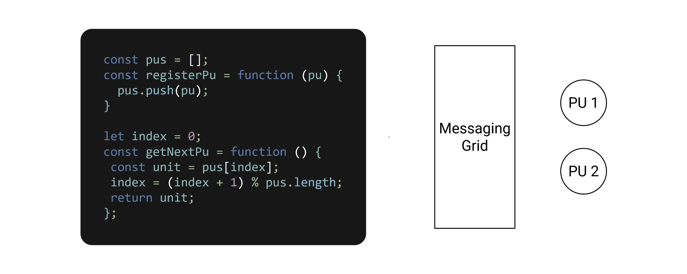

### Inhalt

1. [Implementierung](#1-implementierung)
   1. [Webfrontend](#11-webfrontend)
   2. [Processing-Unit](#12-processing-unit)
   3. [Middleware](#13-middleware)
   4. [Data-Reader/Writer](#14-data-readerwriter)
2. [Motions-Canvas Diagramme](#2-motion-canvas-diagramme)
   1. [Requirements](#21-requirements)
   2. [Diagramme einsehen](#22-diagramme-einsehen)
3. [Installation des Systems](#3-installation-des-systems)
   1. [Requirements](#31-requirements)
   2. [Installationsschritte](#32-installationsschritte)

# 1. Implementierung

Hier wird eine grobe Übersicht über die selbst programmierten Komponenten der Architektur geschaffen.

## 1.1 Webfrontend

TODO

## 1.2 Processing-Unit

Der Code befindet sich im Ordner `processing-unit`. Das Fastify-Backend ist in zwei Hauptbereiche `routes` und `plugins` aufgeteilt

### Routes

Im Unterordner `routes` werden die verschiedenen Endpunkte implementiert.

| Unterordner | Beinhaltet                                                                                                                                                                               |
| ----------- | ---------------------------------------------------------------------------------------------------------------------------------------------------------------------------------------- |
| models      | Read & Write Endpunkt für jede Tabelle                                                                                                                                                   |
| create      | Endpunkte zum Erstellen von Spielern & Scores. Die Endpunkte legen jeweils auch die nötigen Join-Einträge an                                                                             |
| details     | Endpunkte zum Abfragen der Spieler und Scores, welche nicht über direkt über die `models` ablaufen. Als Beispiel das Abfragen von Spielern mit deren Scores und Bildern in einer Anfrage |
| dev         | Endpunkte für die Entwicklung um Typedefs und Plugins automatisch zu generieren                                                                                                          |

### Plugins

In dem Unterordner `plugins` befinden sich die verschiedenen NodeJs Logik Implementierungen

| Unterordner   | Beinhaltet                                                                                                              |
| ------------- | ----------------------------------------------------------------------------------------------------------------------- |
| pu            | Datenlogik für die eigentliche Geschäftslogik. Unter anderem die Logik für die `models`, `create` & `details` Endpunkte |
| elasticsearch | Senden von Daten an die Elasticsearch Instanz                                                                           |
| performance   | Bestimmung der Performance-Metriken                                                                                     |
| dev           | Implementation der Datei-Generatoren                                                                                    |

## 1.3 Middleware

Der Code befindet sich im Ordner `middleware`. Das Fastify-Backend ist in zwei Hauptbereiche `routes` und `plugins` aufgeteilt

### Routes

Im Unterordner `routes` werden die verschiedenen Endpunkte implementiert.

| Unterordner | Beinhaltet                                                                                                                                                                                                                                  |
| ----------- | ------------------------------------------------------------------------------------------------------------------------------------------------------------------------------------------------------------------------------------------- |
| deployment  | Endpunkte um das Hinzufügen einer Processing-Unit zu testen                                                                                                                                                                                 |
| messaging   | Endpunkte mit welchen sich die Processing-unit bei der Middleware registrieren kann. beinhaltet auch jeden Endpunkt der Processing-Unit im Unterordner `pu`. Die `pu` Endpunkte leiten die Anfragen an die jeweilige Processing-Unit weiter |
| simulator   | Endpunkt um eine Simulation zu starten                                                                                                                                                                                                      |
| dev         | Endpunkte für die Entwicklung um Typedefs zu generieren                                                                                                                                                                                     |

### Plugins

In dem Unterordner `plugins` befinden sich die verschiedenen NodeJs Logik Implementierungen

| Unterordner   | Beinhaltet                                                                                                             |
| ------------- | ---------------------------------------------------------------------------------------------------------------------- |
| deployment    | Logik um Processing-Units zu erzeugen und abzuschalten. Die Implementierung der verschiedenen Performance Grenzwerten. |
| elasticsearch | Senden von Daten an die Elasticsearch Instanz                                                                          |
| messaging     | Das Registrieren und Entfernen von Processing-Units für das Messaging-Grid                                             |
| performance   | Bestimmung der Performance-Metriken des gesamten Host-Systems                                                          |
| simulator     | Das Simulieren von konstanten Lasten durch Erstellung von Spielern & Scores                                            |
| dev           | Implementation der Datei-Generatoren                                                                                   |

### Volumes

Über die Datei `./volumes/config/middleware/deployment.jsonc` kann die verwendete Deployment-Metrik und deren Grenzen festgelegt werden

## 1.4 Data-Reader/Writer

Dieses Fastify-Backend beinhaltet lediglich den Bereich `plugins` da die Kommunikation über MQTT geregelt wird.

### Plugins

In dem Unterordner `plugins` befinden sich die verschiedenen NodeJs Logik Implementierungen

| Unterordner | Beinhaltet                                                                                                            |
| ----------- | --------------------------------------------------------------------------------------------------------------------- |
| mqtt        | Den Verbindungsaufbau zu MQTT. Des Weiteren auch die Implementierung der Mapping-, Read- und Write-Requests/Responses |
| mysql       | Kapselung der Zugriffe auf die MySQL Datenbank                                                                        |
| dev         | Implementation des Typedef-Generators                                                                                 |

# 2. Motion-Canvas Diagramme

Die animierten Diagramme wurden mittels Motion Canvas (https://github.com/motion-canvas/motion-canvas) erstellt.

## 2.1 Requirements

1. Node (Getestet mit Version 22.14.0)
2. NPM (Getestet mit Version 10.9.2)

## 2.2 Diagramme einsehen

Folgender Verlauf wird verwendet um die Diagramme zu zeigen:

1. `cd ./motion-canvas`
2. `npm install`
3. `npm start`
4. Lokale Webseite die in der Konsole ausgegeben wird öffnen

# 3. Installation des Systems

## 3.1 Requirements

1. Linux OS (Zugriff auf /var/run/docker.sock)
2. Docker (Getestet mit 28.0.4)
3. Docker Compose (Getestet mit 2.3.3)
4. Node (Getestet mit 23.11.0)
5. NPM (Getestet mit 10.9.2)

## 3.2 Installationsschritte

Um das System auf einem lokalen Rechner zu starten werden folgende Schritte durchgeführt:

1. Die folgenden Ordner und Dateien in eine Linux-Umgebung kopieren
   - `data-rw`
   - `middleware`
   - `processing-unit`
   - `volumes`
   - `.env`
   - `docker-compose.yml`
   - `hazelcast.yaml`
2. Die NodeJs Projekte initialisieren. Dafür `npm install` in folgenden Ordner ausführen:
   - `data-rw`
   - `middleware`
   - `processing-unit`
3. Über `docker pull hazelcast/hazelcast:latest` das Hazelcast Image herunterladen
   - Ist nötig, da die Docker Compose Datei kein Container mit diesem Image beinhaltet
4. Die Einstellungen der `.env` Datei anpassen
   - Die `NETWORK_IP` auf die eigene IP abändern
   - Den Pfad `PROCESSING_UNIT_VOLUME` anpassen, sodass der `processing-unit` Ordner referenziert wird. Dabei den absoluten Pfad angeben
5. Die Docker Container über `docker compose up -d` starten
   - Sicherstellen, dass dieser Befehl in dem Ordner mit der `docker-compose.yml` ausgeführt wird
   - Dieser Befehl könnte einige Minuten dauern
   - Die Container `middleware` und `data-rw` warten bis `rabbitmq` erreichbar ist
6. Unter folgenden Ports sind die Anwendungen bereitgestellt
   - `80`: Webfrontend
   - `3000`: Middleware
     - Über `:3000/simulate?duration=60000&interval=500&minScore=1` wird eine 1 minütige Simulation gestartet
   - `8080`: Hazelcast-Management-Center

# TODO: Webfrontend URL muss angepasst werden
